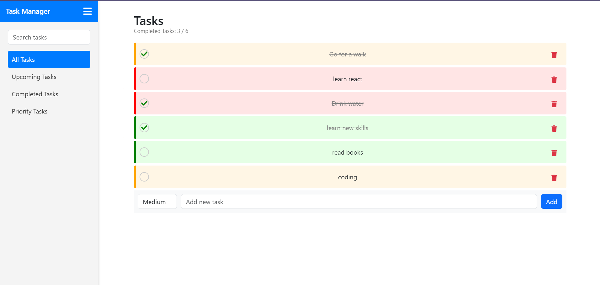

# Task Manager

Task Management App
This repository contains the source code for a Task Management Application built using React.js. The app is designed to help users manage their daily tasks efficiently, with features like task prioritization, filtering, and persistent storage using local storage.
________________________________________

Project Overview
The app provides a structured way to create, organize, and manage tasks. It uses React's state management to dynamically handle task operations and ensures tasks are saved in the browser's local storage for persistence.

________________________________________

How the Code Works
1. App Structure
The application is divided into multiple components for better readability and modularity:
•	App.jsx: The main component that manages overall state and layout.
•	Sidebar.jsx: Handles navigation, task filtering, and search functionality.
•	TaskList.jsx: Displays the list of tasks and manages their rendering and behavior.
•	TaskItem.jsx: Represents a single task, providing options to mark as complete or delete.
•	App.css: Contains all the styles for the application.
________________________________________

2. Core Features and Their Implementation
a. Task Addition
Users can add tasks with the following attributes:
•	ID (unique for each task).
•	Text (task description).
•	Completed (whether the task is done or not).
•	Priority (High, Medium, or Low).
Code for adding a task is in TaskList.jsx:

const handleAddTask = () => {
  if (newTask.trim()) {
    addTask({ id: Date.now(), text: newTask, completed: false, priority });
    setNewTask('');
    setPriority('Medium');
  }
};
________________________________________
b. Task Storage
Tasks are saved in the browser’s local storage using React’s useEffect:

useEffect(() => {
  localStorage.setItem('tasks', JSON.stringify(tasks));
}, [tasks]);
This ensures that all tasks persist even after the page is refreshed.
________________________________________
c. Task Prioritization
The app displays tasks based on their priority when the "Priority" tab is active. The sorting logic is:

const sortedTasks = [...filteredTasks].sort((a, b) => {
  const priorityOrder = { High: 1, Medium: 2, Low: 3 };
  return priorityOrder[a.priority] - priorityOrder[b.priority];
});
High-priority tasks appear at the top, followed by Medium and Low.
________________________________________
d. Task Filtering
The sidebar allows users to filter tasks by categories:
•	All Tasks: Displays all tasks.
•	Upcoming Tasks: Shows incomplete tasks.
•	Completed Tasks: Displays only completed tasks.
•	Priority Tasks: Orders tasks by their priority.
The filtering logic in App.jsx:

const filteredTasks = tasks.filter((task) => {
  if (activeTab === 'All') return true;
  if (activeTab === 'Completed') return task.completed;
  if (activeTab === 'Upcoming') return !task.completed;
  return true;
});
________________________________________
e. Task Search
Users can search for tasks using the search bar in the sidebar. The search query dynamically filters tasks based on their text:

const visibleTasks = sortedTasks.filter((task) =>
  task.text.toLowerCase().includes(searchQuery.toLowerCase())
);
________________________________________
f. Task Completion
Tasks can be marked as completed or uncompleted by toggling their completed state:

const toggleComplete = (id) => {
  setTasks(
    tasks.map((task) =>
      task.id === id ? { ...task, completed: !task.completed } : task
    )
  );
};
________________________________________
g. Task Deletion
Users can delete tasks by clicking the delete icon:

const deleteTask = (id) => {
  setTasks(tasks.filter((task) => task.id !== id));
};
________________________________________
3. Component Interaction
•	App.jsx:
o	Manages the overall state: tasks, searchQuery, and activeTab.
o	Provides state and functions as props to Sidebar and TaskList.
•	Sidebar.jsx:
o	Handles filtering logic and search queries.
o	Allows toggling between tabs (e.g., All, Completed, Priority).
•	TaskList.jsx:
o	Displays tasks based on the selected tab and search results.
o	Passes individual task operations (delete, complete) to TaskItem.
•	TaskItem.jsx:
o	Renders each task with priority-specific styles.
o	Allows marking tasks as completed or deleting them.
________________________________________
Technologies Used
•	Frontend: React.js
•	Styling: CSS, Bootstrap
•	Icons: Font Awesome React Icons
•	State Management: React's useState and useEffect
•	Data Storage: Browser’s Local Storage
________________________________________
Developer
This project was created by Rohit.
Feel free to contribute, raise issues, or suggest improvements! 😊

